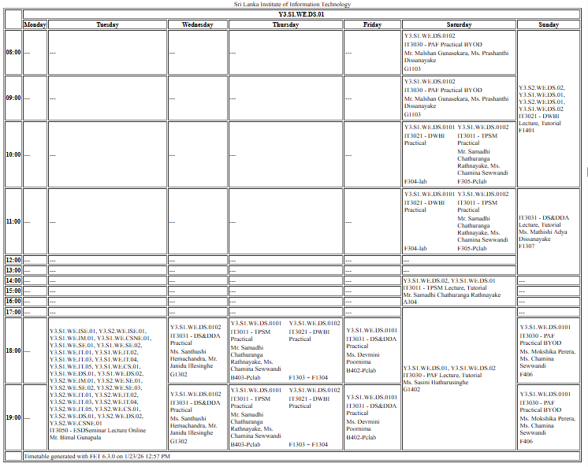
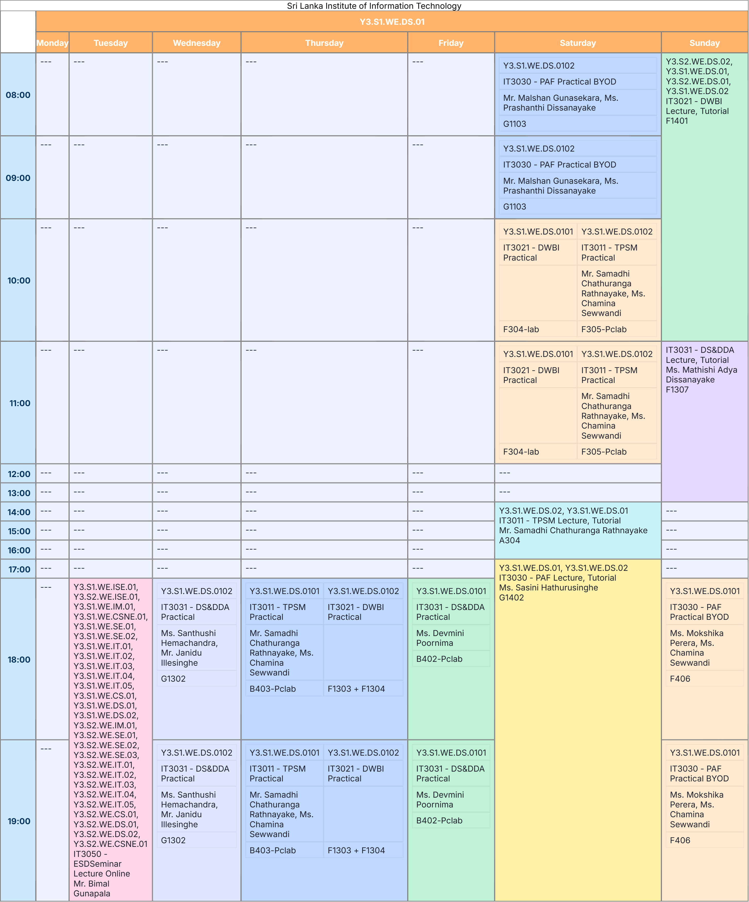

# 📅 UniTimetable (SLIIT)
<br>
Convert the **official SLIIT FET-generated timetable** into a clean, colorful, and student-friendly version - in just one click. ✨

No more boring tables. Download your timetable as **PNG** 🖼️ or **PDF** 📄.


<br>

## 🎨 Preview

Transform your timetable from cluttered to clean:

| 📋 Before | ✅ After |
|--------|-------|
|  |  |

<div align="center">
  
[](https://universitytimetable.vercel.app/)
[](https://github.com/Danidu-Muhandiram/unitimetable)

</div>

<br>

## 📖 How to Use

1. **📤 Upload Your Timetable**
   - Click "Upload official timetable (.html)"
   - Select the HTML file

2. **🎯 Select Your Group**
   - Choose your Year (Y1, Y2, Y3, Y4)
   - Select Semester (S1, S2)
   - Pick Mode (Weekday/Weekend)
   - Choose Specialization (DS, IM, CS, CSE, IT, CSNE, ISE, COM)
   - Select your Group number (01-10)

3. **👀 View Your Timetable**
   - Click "🔍 Search for Timetable"
   - Your personalized schedule appears with color-coded classes

4. **💾 Download**
   - Click "Download PNG" for an image file 🖼️
   - Click "Download PDF" for a printable document 📄

<br>

## 🚀 Future Development

- 🔄 **Subgroup Filtering** - Filter and view specific subgroups within your selected group

<br>

## 🛠️ Technologies Used

- **HTML5** - Structure and markup
- **CSS3** - Styling and responsive design
- **Vanilla JavaScript** - All functionality, no frameworks
- **html2canvas** - PNG export functionality
- **jsPDF** - PDF export functionality

<br>

## 📁 File Structure

```
UniTimetable/
├── index.html          # Main HTML structure
├── style.css           # All styling and themes
├── script.js           # Core functionality
└── README.md           # Readme
```

## License

Free to use for personal and educational purposes.


